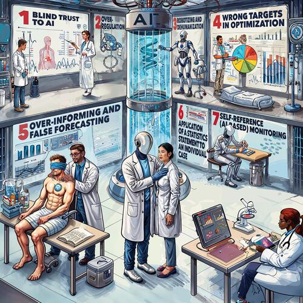

# The Seven Sins of Medical Artificial Intelligence
Survey on  critical ethical challenges in medical AI

[Heimo Müller](https://scholar.google.at/citations?hl=de&user=-Wgn7fQAAAAJ)
[Vimla L. Patel](https://scholar.google.com/citations?hl=en&user=blg0nusAAAAJ)
[Edward H. Shortliffe](https://scholar.google.com/citations?hl=en&user=KIv0fKQAAAAJ)
[Igor Jurisica](https://scholar.google.ca/citations?hl=en&user=Hi9ALnkAAAAJ)
[Andreas Holzinger](https://scholar.google.com/citations?hl=en&user=BTBd5V4AAAAJ)

## Abstract

The global adoption of artificial intelligence (AI) in critical sectors such as human health is accelerating, yet it brings with it a complex landscape of ethical, social, and regulatory challenges. Our study explores international perceptions of AI-related risks within the framework of the *Seven Sins of AI*, focusing on seven concerns: (1) blind trust, (2) overregulation, (3) dehumanization, (4) optimization bias, (5) misinformation, (6) statistical misapplication, and (7) self-referentiality. Drawing on 914 survey responses from a wide range of geographic regions and professional domains, our analysis reveals pronounced differences in how these risks are perceived.

Countries with established AI research and governance structures tend to approach AI developments with caution, expressing heightened concern particularly about blind trust and self-referential systems. In contrast, respondents from regions with less institutionalized AI infrastructure adopt a more optimistic stance, viewing AI as a transformative opportunity to improve health accessibility and quality. Interestingly, many participants noted that AI-based systems were perceived as more approachable, consistent, and empathic than stereotypically overburdened clinical human physicians.

These findings underscore the importance of nuanced, context-sensitive governance strategies that foster trust and ensure accountability while enabling innovation. The study provides empirical evidence to inform global discussions on the development of human-centered and trustworthy AI.

## Introduction

The use of Artificial Intelligence (AI) in medicine has a long tradition [Shortliffe, 1973] and there is no debate that it has the potential to greatly improve healthcare delivery and outcomes [Rajpurkar et al., 2022]. Tremendous advances in the provision of computing power and the availability of large amounts of training data have led to huge improvements in the accuracy with which computers can perform tasks that were previously considered the exclusive province of human intelligence. In medicine and healthcare, this has led to a rapidly growing interest in the potential of AI to improve clinical practice [Cohen, Patel, & Shortliffe, 2022; Rao, 2025].

However, as with any new technology, it is important to be aware of potential risks and adverse challenges that may arise. In this context, the following *Seven Deadly Sins of AI in Medicine* have been identified in a community process:

1. **Blind trust**: Over-reliance on AI systems without proper validation or verification can lead to incorrect or inappropriate decision making, resulting even in harm to humans.  
2. **Over-regulation (no guts, no glory)**: Excessive regulation could prevent innovation and progress, as overly strict rules may limit the ability of researchers and developers to experiment and take risks.  
3. **Robotizing and dehumanization**: AI systems that replace human interaction and compassion in the patient-doctor relationship can lead to a loss of empathy and decreased patient satisfaction.  
4. **Wrong targets in optimization**: AI systems that prioritize metrics misaligned with patient outcomes can result in suboptimal decision making.  
5. **Over-informing and false forecasting**: AI systems that generate too much information or false predictions can lead to confusion and decreased trust.  
6. **Application of a statistics statement to an individual case**: AI systems relying solely on statistical models without considering individual circumstances can make inappropriate decisions.  
7. **Self-reference (AI-based) monitoring**: Systems that evaluate themselves without external oversight may lack accountability and transparency.

## Methods

This study employed a structured survey methodology to investigate global perspectives on the perceived risks of AI in medicine. The survey was designed around the conceptual framework of the *Seven Sins of AI*, a taxonomy developed through community-based discussions that captures key ethical and operational concerns: blind trust, over-regulation, dehumanization, optimization bias, misinformation, statistical misapplication, and self-referential AI monitoring.

The questionnaire included demographic items and Likert-scale statements reflecting each of the seven concerns. Respondents indicated their level of agreement on a five-point scale from "Fully Agree" to "Fully Disagree." The online survey collected 940 responses, of which 915 were retained after preprocessing, primarily standardizing country names.

Participants represented diverse professional fields—medicine, AI, IT, management, and research—and a broad range of geographical regions, ensuring international representation. Descriptive statistics were used to analyze responses across demographic categories such as continent, age group, and expertise. Special attention was given to regional variation, especially between countries with advanced AI ecosystems ("AI countries") and those in emerging economies or the Global South ("non-AI countries").

This methodology allowed for identifying patterns in risk perception tied to geography, generation, and profession, providing empirical grounding for global AI governance discourse.

The survey was developed and administered using **EUSurvey**, the European Commission's official online survey tool. EUSurvey, launched in 2013 by DG DIGIT, is free, open-source (EUPL), and compliant with EU data protection standards. The platform enabled creation of a multilingual, customizable survey including Likert scales, multiple-choice formats, and conditional logic, and ensured accessibility and offline capabilities.

EUSurvey supported secure and anonymous response collection via direct email invitations and facilitated data analysis through built-in tools and export functionality. Its reliability, flexibility, and privacy features made it a fitting infrastructure for this international study.

**Landing page of the survey:** [https://human-centered.ai/7-sins-of-medical-ai/](https://human-centered.ai/7-sins-of-medical-ai/)

## Results

### General Demographics

We received a total of 940 responses, of which 915 were considered valid. Only minimal preprocessing was necessary, primarily to standardize country names. For example, variations such as “States,” “United States,” “America,” “US,” “The US,” “United States of America,” or “U.S.A.” were all uniformly labelled as "USA".

### Distribution of Responses by Continent

The survey respondents were distributed across different continents, providing a diverse range of perspectives on AI risks. The following pie chart illustrates the distribution of responses by continent (see the detailed results with the figures).

The analysis reveals notable patterns in attitudes towards AI based on geographic origin. Respondents from typical AI-leading nations, such as the USA, Japan, and Canada, strongly advocate for stringent oversight and regulation, expressing significant concern about AI over-reliance and self-referential monitoring systems.

In contrast, respondents from countries in the Global South [Chinasa et al., 2022] or emerging economies, including African countries, display high enthusiasm towards AI adoption, largely favoring innovation with minimal regulatory constraints. This divergence suggests a geographical split: technologically advanced nations tend to prioritize risk management and accountability, whereas countries in the Global South are more inclined to embrace AI opportunities, viewing excessive regulation as a potential impediment to progress.

### Distribution of Responses by Age

Age diversity was also analyzed to understand generational differences in AI perception.

Respondents aged 20–39 represent the largest share, with 385 responses (42.78%). Respondents aged 40–59 form the second-largest group, with 330 responses (36.67%). Individuals above 60 years of age provided 150 responses (16.67%), while those below 20 years old account for the smallest proportion, with only 35 responses (3.89%).

### Distribution of Responses by Field

The survey participants could select multiple fields relevant to their work (e.g., Medicine, Artificial Intelligence, Information Technology, Management, Research, Decision Making). The analysis of single-field expertise shows that respondents predominantly identify with "Medicine" or "Artificial Intelligence," with "Research" also well represented. This indicates that the survey captured responses primarily from professionals directly engaged in relevant domains and helps explain the under-representation of the below-20 age group. The dominance of these categories underscores that the findings are shaped by specialized perspectives from AI, healthcare, and research sectors.

## Results: Public Perception of AI Risks

To assess the perception of different AI risks, the survey included statements on seven key concerns related to AI ethics and governance. Responses were categorized into five levels: Fully Agree, Partly Agree, Neutral, Partly Disagree, and Fully Disagree. The results for each AI risk (Sin) are detailed below.

### Sin 1 - Blind Trust in AI

Blind trust in AI was one of the most widely agreed-upon concerns. About 85% of respondents fully agree that over-reliance on AI without sufficient validation or verification can result in incorrect or inappropriate decision-making, potentially causing harm. An additional 9.4% partly agree. Only a small minority expressed disagreement (2.3% fully disagree, 1.5% partly disagree) or neutrality (1.9%). This highlights a strong consensus on the need for robust validation, transparency, and accountability in AI systems.

### Sin 2 - Over-regulation

Opinions on regulation are split. Approximately 53.6% fully agree, and 27.6% partly agree, that excessive regulation could hinder innovation and experimentation. A minority disagree (2.6% fully, 7.7% partly), while 8.5% remain neutral. Geographical differences are notable: respondents from countries like the USA, Canada, and Japan favor stronger oversight, whereas those from the Global South tend to oppose heavy regulation, viewing it as a barrier to technological progress.

### Sin 3 - Robotizing and Dehumanization

Substantial agreement was found regarding the risk of AI replacing essential human interactions, especially in healthcare. Around 58.5% of respondents fully agree and 19.9% partly agree that this trend may lead to a loss of empathy and lower patient satisfaction. A small minority disagrees (2.6% fully, 9.2% partly), while 9.7% are neutral. These responses reflect ethical concerns about the social impact of AI in human-centered environments.

### Sin 4 - Wrong Targets in Optimization

A large majority of respondents (68.0% fully agree, 17.7% partly agree) are concerned that AI systems may optimize for metrics not aligned with meaningful human outcomes. Only a small share disagrees (1.0% fully, 3.1% partly) or remains neutral (9.6%). This indicates a strong preference for aligning AI objectives with genuine societal or clinical goals.

### Sin 5 - Over-informing and False Forecasting

Roughly 72.5% of respondents fully agree and 18.5% partly agree that excessive or misleading AI-generated information can reduce trust and cause confusion. Disagreement is minimal (1.5% fully, 2.4% partly), and only 5.0% remain neutral. These results emphasize the importance of accurate, concise, and trustworthy information delivery in AI systems.

### Sin 6 - Application of Statistical Statements to Individual Cases

Concerns about the misuse of statistical models for individual decision-making are widely shared. About 68.4% fully agree, and 20.7% partly agree, that such use can lead to inappropriate outcomes. Very few respondents disagree (1.5% fully), and 9.6% are partly disagreeing or neutral. This underscores a demand for individualized approaches in domains like healthcare and justice.

### Sin 7 - Self-referential AI-based Monitoring

This was among the most concerning risks. About 76.0% fully agree and 14.8% partly agree that AI systems evaluating themselves without external oversight risk reduced accountability and transparency. Disagreement is negligible (0.7% fully, 2.4% partly), with 6.1% neutral. This highlights a near-universal call for independent supervision in AI systems.

Overall, the results reflect significant public concern about AI's role in decision-making, the risks of misinformation, and the need for human oversight. Variations across demographic groups suggest that familiarity with AI influences perception, pointing to the need for broader education and transparent governance.

## Conclusion

The survey results reveal broad awareness of the ethical and operational risks associated with AI. Participants strongly emphasize the need to avoid blind trust, misaligned objectives, misleading outputs, and the uncritical application of statistical models. Self-referential AI monitoring without oversight is also a key concern.

Notably, geographic differences emerged: respondents from AI-leading nations advocate for comprehensive regulation, while those from the Global South warn against overregulation that may inhibit innovation. These insights support the development of balanced, context-sensitive governance frameworks that uphold accountability, transparency, and human-centric values while fostering innovation in global AI deployment.

## References

Okolo, C.T., 2022. Optimizing human-centered AI for healthcare in the Global South. *Patterns*, 3(2), p.100421. Available at: [https://doi.org/10.1016/j.patter.2021.100421](https://doi.org/10.1016/j.patter.2021.100421).

Cohen, T.A., Patel, V.L. and Shortliffe, E.H., 2022. Introducing AI in Medicine. In: T.A. Cohen, V.L. Patel and E.H. Shortliffe, eds. *Intelligent Systems in Medicine and Health. Cognitive Informatics in Biomedicine and Healthcare*. Cham: Springer, pp.3–20. Available at: [https://doi.org/10.1007/978-3-031-09108-7_1](https://doi.org/10.1007/978-3-031-09108-7_1).

Holzinger, A., Keiblinger, K., Holub, P., Zatloukal, K. and Müller, H., 2023. AI for Life: Trends in Artificial Intelligence for Biotechnology. *New Biotechnology*, 74(1), pp.16–24. Available at: [https://doi.org/10.1016/j.nbt.2023.02.001](https://doi.org/10.1016/j.nbt.2023.02.001).

Holzinger, A., Kargl, M., Kipperer, B., Regitnig, P., Plass, M. and Müller, H., 2022. Personas for Artificial Intelligence (AI): An Open Source Toolbox. *IEEE Access*, 10, pp.23732–23747. Available at: [https://doi.org/10.1109/ACCESS.2022.3154776](https://doi.org/10.1109/ACCESS.2022.3154776).

Holzinger, A. and Müller, H., 2021. Toward Human-AI Interfaces to Support Explainability and Causability in Medical AI. *IEEE Computer*, 54(10), pp.78–86. Available at: [https://doi.org/10.1109/MC.2021.3092610](https://doi.org/10.1109/MC.2021.3092610).

Mueller, H., Mayrhofer, M.T., Van Veen, E.B. and Holzinger, A., 2021. The Ten Commandments of Ethical Medical AI. *IEEE Computer*, 54(7), pp.119–123. Available at: [https://doi.org/10.1109/MC.2021.3074263](https://doi.org/10.1109/MC.2021.3074263).

Rajpurkar, P., Chen, E., Banerjee, O. and Topol, E.J., 2022. AI in health and medicine. *Nature Medicine*, 28(1), pp.31–38. Available at: [https://doi.org/10.1038/s41591-021-01614-0](https://doi.org/10.1038/s41591-021-01614-0).

Rao, V.M., Hla, M., Moor, M., Adithan, S., Kwak, S., Topol, E.J. and Rajpurkar, P., 2025. Multimodal generative AI for medical image interpretation. *Nature*, 639(8056), pp.888–896. Available at: [https://doi.org/10.1038/s41586-025-08675-y](https://doi.org/10.1038/s41586-025-08675-y).

Shortliffe, E.H., Axline, S.G., Buchanan, B.G., Merigan, T.C. and Cohen, S.N., 1973. An artificial intelligence program to advise physicians regarding antimicrobial therapy. *Computers and Biomedical Research*, 6(6), pp.544–560. Available at: [https://doi.org/10.1016/0010-4809(73)90029-3](https://doi.org/10.1016/0010-4809(73)90029-3).

